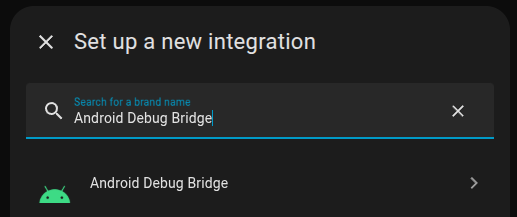
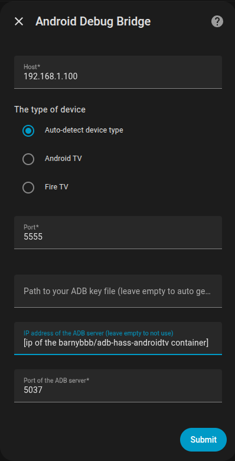

# adb-hass-androidtv

## Overview
Connect to and control androidtv/firetv/googletv devices through ADB.

This image will start an ADB (Android Debug Bridge) server listening on port 5037 and connect to a list of specified androidtv/firetv/googletv devices over the network. This will allow you to integrate them with [Home Assistant](https://www.home-assistant.io/) using the [AndroidTV integration](https://www.home-assistant.io/integrations/androidtv/).

## Features
- Quick and easy connection to Android based devices over the network.
- Lightweight Alpine based image.
- Supports environment variable or yaml file configuration.
- Support for devices based up to Android 15.
- Support wireless ADB connections (adbwifi) that require `pairing code` and `pairing port`.
- Input validation.
- Logging with rotation.

## Usage

### Docker

Run in docker, mounting a volume that stores a `config.yml` file for configuration:
```shell
docker run -it -v /tmp:/opt/androidtv-connect barnybbb/adb-hass-androidtv:latest
```

Run in docker, using environment variables:
```shell
docker run -it -e devicelist=192.168.1.100,192.168.1.101::739264:44556 -e bootwait=10 -e checkfreq=60 barnybbb/adb-hass-androidtv:latest
```

Docker compose, mounting a volume that stores a `config.yml` file for configuration:
```yml
services:
  adb-hass-androidtv:
    image: barnybbb/adb-hass-androidtv:latest
    hostname: adb-hass-androidtv.local
    container_name: adb-hass-androidtv
    ports:
      - 5037:5037
    volumes:
      - /tmp:/opt/androidtv-connect
    restart: unless-stopped
```

Docker compose, using environment variables:
```yml
services:
  adb-hass-androidtv:
    image: barnybbb/adb-hass-androidtv:latest
    hostname: adb-hass-androidtv.local
    container_name: adb-hass-androidtv
    ports:
      - 5037:5037
    environment:
      devicelist: 192.168.1.100,192.168.1.101::739264:44556
      bootwait: 10
      checkfreq: 300
    restart: unless-stopped
```

### UnRAID

You can use the UnRAID Community Template provided details are available on the [UnRAID Forums](https://forums.unraid.net/topic/101087-support-android-debug-bridge-adb-corneliousjd-repo/).

## Configuration
Configuration is managed via a YAML file (`config.yml`) located in `/opt/androidtv-connect`, or by setting environment variables. See below.

### Configuration Options

These can be specified as environment variables or included in the `config.yml` file.
Options provided in the `config.yml` will override any provided as environment variables.

| config option | default | required | description |
|--|--|--|--|
| devicelist | n/a | yes | List of Android device(s) to connect to and their connection settings |
| bootwait | 10 | no | Time to wait (in seconds) for before attempting connection to device(s) at container init |
| checkfreq | 300 | no | Frequency (in seconds) to check device(s) connection status |
| enable_adb_usb | no | no | Enable USB ADB connection |

For the environment variable `devicelist` must be a comma separated list of devices specified in the following format:

`<host>[:<port>][:<auth_code>:<auth_port>]`

- `<host>` - required, IP address or hostname of the Android device
- `<port>` - optional, defaults to `5555` if not specified
- `<auth_code>` - optional, pairing code for ADB wireless pairing
- `<auth_port>` - optional, pairing port for ADB wireless pairing (must be specified with `<auth_code>`)

Examples:

- `192.168.1.100` - specify a single device, will default to connect to ADB port `5555`
- `192.168.1.100:5555,192.168.101:5555` - specify two devices, both connecting to ADB port `5555`
- `192.168.1.101:5555:739264:44556` - specify a single device, with **auth_code** and **auth_port** specified
- `192.168.1.100,192.168.1.101::739264:44556` - specify two devices, with the second device using the default port of `5555` and with **auth_code** and **auth_port** specified

### Typical Configuration File Example
```yml
devicelist:
  - name: Living Room TV
    host: 192.168.1.100
    port: 12345
  - name: Bedroom TV
    host: 192.168.1.101
    port: 15555
    auth_code: 739264
    auth_port: 44556
```

### Full Configuration File Example
```yml
bootwait: 10
checkfreq: 300
enable_adb_usb: no
devicelist:
  - name: Living Room TV
    host: 192.168.1.100
    port: 5555
    auth_code: 48273
    auth_port: 11223
  - name: Bedroom TV
    host: 192.168.1.101
    port: 5555
    auth_code: 739264
    auth_port: 44556
```

### Home Assistant

- Install the `Android Debug Bridge` integration
  - Settings
  - Add integration
  - Search for `Android Debug Bridge`



- Add each Android device (as you have configured in the container settings)
  - Settings
  - Android Debug Bridge
  - Add device
  - Complete the device configuration
    - `Host`: the hostname/IP of your Android device (as configured in the devicelist)
    - `Port`: the port your Android device is listening on (as configured in the devicelist)
    - `IP address of the ADB server`: the hostname/IP address of the barnybbb/adb-hass-androidtv docker container
    - `Port of the ADB server`: port that the barnybbb/adb-hass-androidtv docker container is listening on (default 5037)
  - Submit



## License

This project is licensed under the MIT License. See the [LICENSE](LICENSE) file for details.

## GitHub Project

[BLBurgess/adb-hass-androidtv](https://github.com/BLBurgess/adb-hass-androidtv)

## Version History

| Image Version | Release Date | Alpine Version | ADB Version | Release Notes |
|---|---|---|---|---|
| 1.1.0 | 2026-01-29 | 3.23.3 | 36.0.2-14143358 | [See CHANGELOG](CHANGELOG.md#110-2026-01-29) |
| 1.0.0 | 2020-12-22 | 3.22.0 | 29.0.6-6198805 | [See CHANGELOG](CHANGELOG.md#100-2020-12-22) |
